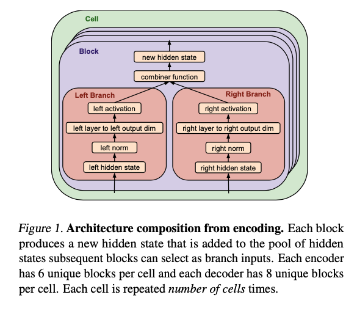
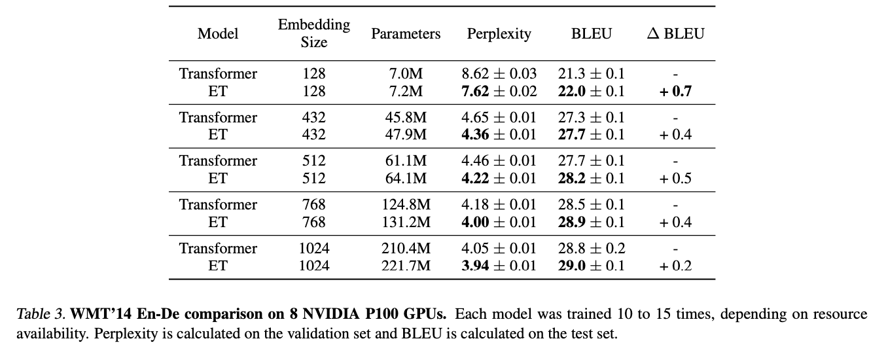
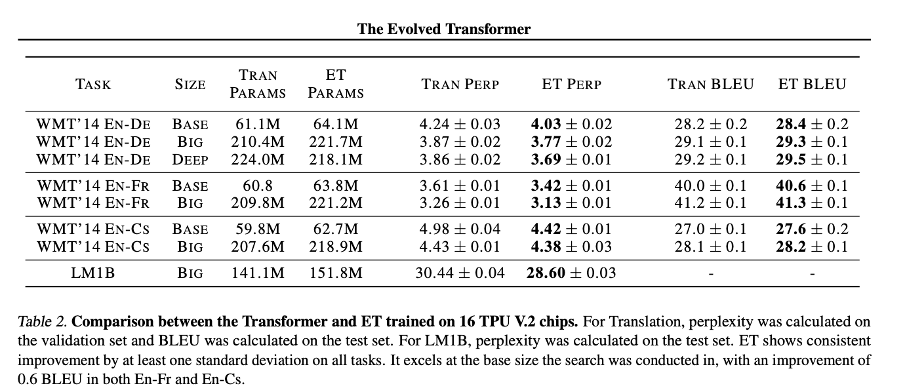

# Evolved Transformer
(summary by Ondřej Měkota)

Paper: **[The Evolved Transformer](https://arxiv.org/abs/1901.11117)** 

## Introduction
This paper improves The [Transformer](https://arxiv.org/abs/1706.03762) by searching for better architecture using an evolutionary algorithm.

The search space is similar to NASNet, in that it uses *cells*, within the cells are *blocks* which take two hidden states and produce one.

However, the search itself is different from NASNet.
They utilize an evolutionary algorithm (*[tournament selection](https://medium.com/@c4lv1nmcg0wan/genetic-algorithms-tournament-selection-b150bc76f0d8)*) and a novel method called *Progressive Dynamic Hurdles (PDH)* which tries to efficiently use *limited* computational resources.

## Methods
Tournament selection is a genetic algorithm which receives an initial population.
In this case represented by encoded network architecture. 
We define a *fitness* score: a function which assigns each individual a value of how good it is (eg. perplexity or BLEU for translation)

Each individual is trained and then evaluated.
The best individuals are call *parents* and are mutated (producing *children*).
Low performing models are removed from the population. 

### Search space
Search space has been created so that it could represent the Transformer.
It consists of two cells, one for encoder and one for decoder.
These cells contain block which can be repeated several times (as in the Transformer).
And the cells themselves can be repeated.

The encoding of an individual is this (see picture below): `[left input, left normalization, left layer, left relative output dimension, left activation, right input, right normalization, right layer, right relative output dimension, right activation, combiner function] × 14 + [number of cells] × 2`

where `14` is there because encoder has 6 blocks and decoder 8 and `2` there is ` type of cell in both encoder and decoder.
The specific *values* of each gene are described in Apendix B.

This search space has size aproximately 10^115.

The initial population is seeded with the Transformer to make the search faster (assuming the Transformer is a good architecture).

### Progressive Dynamic Hurdles
Because training even one Transformer model takes a lot of time and because there is no obvious proxy task (such as when for NASNet - searching on CIFAR instead of ImageNet), they decided to train each individual for shorter period of time.
Only high performing individual were granted more time.

Once *m* individuals were evaluated after (*s0* training steps), their fitness is averaged (*h0*) and those performing more than the average are granted more training steps (s1).
This process is repeated for the next child models.
But if they score more than *h1* after s0+s1 steps, they are granted another s2 steps.
This happens for a predefined list (~3-6) of training step increments (see picture below).
This algorithm is well described in Apendix A, in the paper.

## Results
They evaluate the method on machine translation and language modelling.
Fitness function is perplexity for both tasks.

It has been trained on 16 TPU chips.

They perform an ablation study which shows the effectivness of PDH and the importance of seeding the initial population with the Transformer instead of completely random individuals.

The final Evolved Transformer architecture is shown below (compared to the original Transformer).

The final model (caled Evolved Transformer) achieves BLEU higher than any other model.
Small versions of the model perform also well.

 

# My opinions
### Likes
- I like they do evolution instead of reinforcement learning. I think it is more stable and it works faster (I'd like to see some comparison though).
- The PDH are quite interesting and they make it easier to train the model.
- I like that the final architecture (Evolved Transformer) can be used for many task (as we'll see in the summary of the [next paper](https://arxiv.org/abs/2001.09977)).

### Dislikes
- The PDH may be suboptimal (I'd say they probably are), and there is another, better architecture.
- I really can't think of another thing I do not like about the paper.

